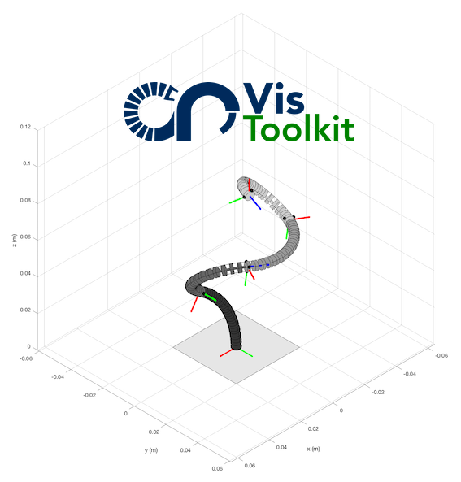

# crVisToolkit
This is a set of MATLAB functions for visualization and plotting of continuum robots.

The Continuum Robot Visualization Toolkit stems from the [Continuum Robotics Laboratory](https://crl.utm.utoronto.ca) codebase and is part of the [Open Continuum Robotics Project](http://opencontinuumrobotics.com/).

## Content
The functions are organized into folders based on the continuum robot type:

- tdcr (tendon-driven continuum robots)
- ***[Coming soon]*** ctcr (concentric tube continuum robots)
- ***[Coming soon]*** util (utility functions, such as robot independent mapping for constant curvature kinematics framework) 

## Contact
If you are interested in contributing, please contact Jessica Burgner-Kahrs [Email](mailto:crl-info@cs.toronto.edu) or submit a pull request on github.
