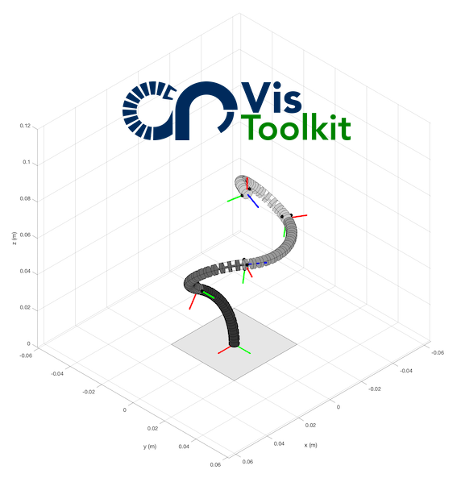

# CRVisToolkit



This is a set of MATLAB and Python functions for visualization and plotting of continuum robots.

NOTE: the MATLAB port of the toolkit is deprecated and no longer maintained. Please open Pull Requests and/or Issues only regarding the Python version.

The Continuum Robot Visualization Toolkit stems from the [Continuum Robotics Laboratory](https://crl.utm.utoronto.ca) codebase and is part of the [Open Continuum Robotics Project](http://opencontinuumrobotics.com/).

# Content
The toolkit is aimed at providing a Python implementation of the [Piecewise Constant Curvature](https://www.opencontinuumrobotics.com/101/2022/12/02/cc-kinematics.html) robot model. Specifically, this library offers working implementations of robot modelling and forward kinematics, a series of inverse-kinematics solvers for these robots, and the ability to plot a robot state using `matplotlib`.

The library makes use of `SpatialMath`, which is an extension to numpy and provides some additional performance benefits, and both the underlying types and return values of many of the methods are SpatialMath objects, which can easily be transformed into their canonnical numpy transformations.

## Modelling
The codebase is centered around two classes, the `ConstantCurvatureSegment` used to model a single segment of a robot, and the `ConstantCurvatureCR` class which represents a robot defined by an ordered list of constant curvature segments. Both classes implement methods for evaluating the forward kinematics of the robot as a SE(3) matrix.

```python
from math import pi
# define a segments by specifying curvature, base frame angle, and length
seg1 = ConstantCurvatureSegment(1 / 30e-3, 0, 50e-3)
seg2 = ConstantCurvatureSegment(1 / 40e-3, pi/6, 70e-3)
seg3 = ConstantCurvatureSegment(1 / 15e-3, 2 * pi/3, 25e-3)

# get the homogenous transformation matrix associated with a single segment
seg1_transformation = self.t_matrix()

# define a robot using a series of segments
cr = ConstantCurvatureCR([seg1, seg2, seg3])

# determine the end-effector pose of the robot
cr_ee_pose = cr.t_matrix()
```


## Inverse Kinematics
This library provides five different inverse-kinematics solver implementations that work with the `ConstantCurvatureCR` class. The exact hyperparameters that can be set for each solver are different, but otherwise the five solvers are implemented to be able to have a uniform interface to make switching between them seamless. A basic example that solves the inverse kinematics of a continuum robot using the Newton-Raphson numerical method is shown below (using the robot defined above).

```python
# take the sample robot from before, use it's end-effector pose as the target
target_pose = cr_ee_pose

# define a copy of the robot with the same segment lengths, but in a different position
seg1 = ConstantCurvatureSegment(1 / 25e-3, pi/12, 50e-3)
seg2 = ConstantCurvatureSegment(1 / 35e-3, pi/4, 70e-3)
seg3 = ConstantCurvatureSegment(1 / 12e-3, 3 * pi/4, 25e-3)

cr = ConstantCurvatureCR([seg1, seg2, seg3])

ik_solver = NewtonRaphsonIkSolver(
    robot,
    NewtonRaphsonIkSettings(), # using default settings, can be customized
    target_pose
)

# run the solver
se3_solver.solve()

# access the robot in its solved state using se3_solver.cr
print(f"the robot now has end-effector pose {se3_solver.cr.t_matrix()}")
```

### Inverse Kinematics evaluation
This library was initially created in an attmept to evaluate the performance of various inverse kinematics solvers in different situations, so there is an additional submodule used for generating test cases for inverse kinematics and then evaluating an inverse kinematics solver with the dataset. Additional details can be found in the `tests` directory.

## Robot Plotting
Finally, utilities to draw a continuum robot in 3D matplotlib plot are provided. A given robot can be drawn as either a concentric tube robot or as a tendon-driven robot. This is done by generating a parameterized representation of the robot's backbone geometry, which is then plotted.


```python
# get discrete paramtereization
starter_plot = robot.as_discrete_curve(pts_per_seg=10)

# draw robot as a 
draw_tdcr(
    starter_plot,
    TDCRPlotterSettings(
        plot_title="NR base case 1 Starter Robot",
        r_disk = 2.5 * 1e-3, # backbone disk radius
        r_height = 1.5 * 1e-3 # backbone disk height
    ),
)

draw_ctcr(
    starter_plot,
    CTCRPlotterSettings(
        plot_title="NR base case 1 Starter Robot",
        r_tube = np.array([2.5, 2.0, 1.5]) * 1e-3 # radii of concentric tubes
    ),
)
```


## Dependencies
The library has official support for Python 3.11 and newer, though it may work on older versions as well.

The library has only a few dependencies that can be seen in the `pyproject.toml`. Dependence on external libraries that do not contribute to performance were kept to a minimum. Installation with poetry according to the lockfile provided is recommended and can be performed by running `poetry install` from the `python` directory.


## Contact
If you are interested in contributing, please contact our lab via [email](mailto:crl-info@cs.toronto.edu) or submit a pull request on github.
